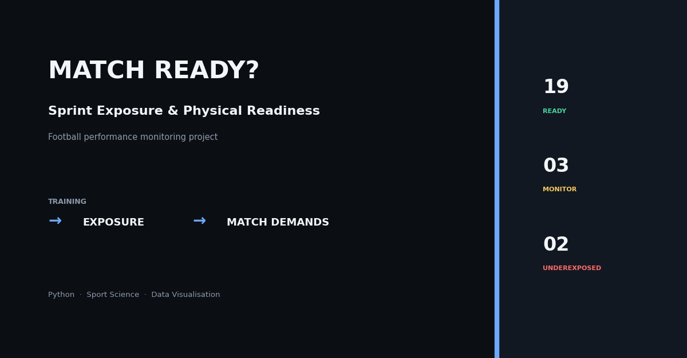
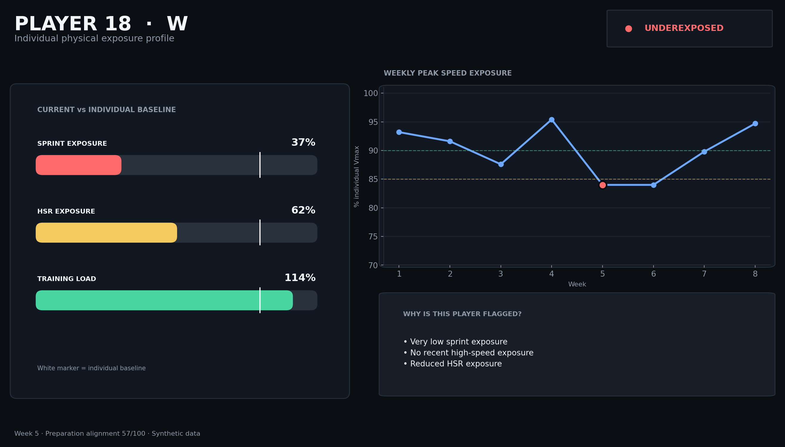
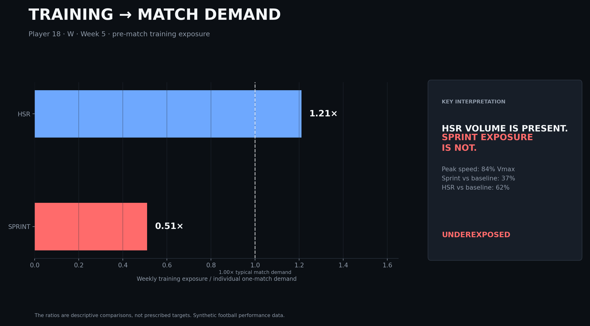

# Match Ready?

**Sprint Exposure & Physical Readiness in Football**

Match Ready? is a portfolio project that simulates a football performance-monitoring workflow around a practical staff question:

> Is the player's recent training exposure consistent with the physical demands we expect from them?

The project combines synthetic training exposure, individual baselines, transparent monitoring rules, interactive visualisation and a staff-oriented Streamlit interface. V3 also adds a real external match-demand reference derived from SkillCorner Open Data (Australian A-League 2024/25).



## Live demo

**Interactive dashboard:** https://match-ready-football.streamlit.app/

Recommended first view:
- **Monitoring week:** Week 5
- **Player:** Player 18 · Winger

This view highlights the main project storyline: overall training volume remains present while sprint-specific exposure is substantially reduced.


## Why this project

Football performance data is easy to turn into dashboards and much harder to turn into interpretable decisions. Match Ready? was designed around three questions:

- **Who needs attention?**
- **Why have they been flagged?**
- **Is the flag unexpected, or explained by the training plan?**

The app therefore avoids an artificial "injury probability" and focuses on exposure, preparation and context.

## Data design

The training dataset is synthetic and designed to reproduce plausible performance-monitoring situations. The external match-demand reference is real and is derived from SkillCorner Open Data.

- 24 outfield players
- 5 position groups: CB, FB, CM, W, ST
- 8 weekly microcycles
- Weeks 1–3: individual baseline acquisition
- Weeks 4–8: monitoring period
- Daily training / match observations
- Total distance, HSR, sprint distance, accelerations, decelerations, peak speed, session RPE, load and wellness

The real match-demand layer uses season-level player-position physical aggregates from the Australian A-League 2024/25. This portfolio processing step keeps position samples with at least five matches and no failed physical quality checks, then exposes P25, P50, P75 and P90 for total distance, HSR, sprint distance and PSV-99.

Goalkeepers are intentionally excluded because their physical demands require a different framework.

See [DATA_SOURCES.md](DATA_SOURCES.md) for provenance, definitions and limitations.

## Designed scenarios

Three specific storylines make the dataset useful to explore.

### P18 — Winger: unexpected speed underexposure

Training volume remains broadly present, while sprint distance and near-max-speed exposure fall substantially.



### P07 — Full Back: accumulated-load context

Week 7 contains a deliberate load increase without the same speed-underexposure pattern.

### P22 — Striker: planned reintegration

Reduced exposure in weeks 4–5 is intentional within a return-to-performance scenario. The numerical flag remains visible, but the interface explicitly shows that the reduction is planned.

This is an important design principle of the project: **monitoring data should support staff judgement, not replace it.**

## Monitoring logic

Current preparation is primarily compared with the player's own baseline.

The monitoring interface uses:

- sprint exposure vs individual baseline
- HSR exposure vs individual baseline
- peak speed as % individual Vmax
- recency of >90% and >95% Vmax exposure
- overall training load vs individual baseline
- wellness context
- pre-match training exposure vs individual match demand

### Preparation Alignment

A custom 0–100 visual index combines:

- 50% sprint alignment
- 25% HSR alignment
- 25% peak-speed exposure

The index is an interface aid for this synthetic portfolio project. It is **not** a validated injury-risk score or a medical metric.

## Training-to-match lens

The app also expresses the pre-match training week relative to each player's synthetic typical one-match demand.



These ratios are descriptive comparisons. `1.00x` means that the total pre-match training-week exposure equals the player's synthetic typical 90-minute match demand; it is not presented as a prescribed target.

## Dashboard

The Streamlit app contains five workspaces:

1. **Squad Overview** — status distribution, priority queue and squad monitoring board
2. **Player Analysis** — player card, exposure profile, real positional match-demand comparison, microcycle and wellness/load context
3. **Real Match Demands** — SkillCorner P25–P90 positional references for HSR, sprint distance, total distance and PSV-99
4. **Exposure Map** — interactive squad-level sprint/HSR positioning
5. **Methodology** — assumptions, monitoring rules, data provenance and designed scenarios

## Project structure

```text
match-ready-football/
├── assets/
│   └── exports/
├── dashboard/
│   └── app.py
├── data/
│   ├── raw/
│   └── processed/
├── src/
│   ├── data_generation.py
│   ├── metrics.py
│   └── visuals.py
├── .streamlit/
│   └── config.toml
├── requirements.txt
└── README.md
```

## Run locally

```bash
pip install -r requirements.txt
python src/data_generation.py
python src/metrics.py
python src/visuals.py
streamlit run dashboard/app.py
```

If the data and visuals are already present, only the last command is required.

## Tech stack

- Python
- pandas
- NumPy
- Plotly
- Matplotlib
- Streamlit

## Important limitation

Training and wellness data are synthetic. The external match-demand reference is derived from real SkillCorner Open Data. Monitoring thresholds are transparent portfolio heuristics created to demonstrate a workflow and interface. The project does not provide medical diagnosis, injury prediction or return-to-play clearance.

The real benchmark layer is based on season-level player-position aggregates, so it captures positional variation across players but does not yet model full fixture-to-fixture variability. That is the next planned analytical layer.
